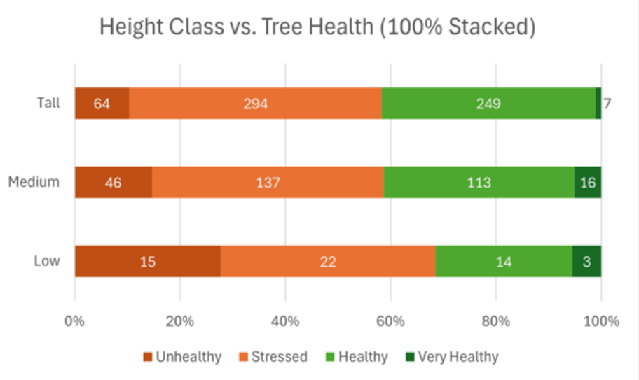
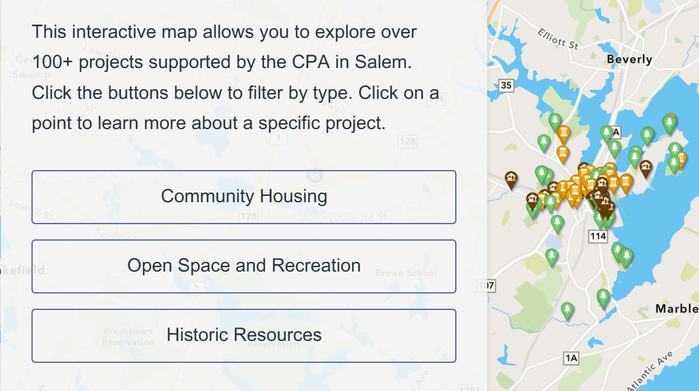
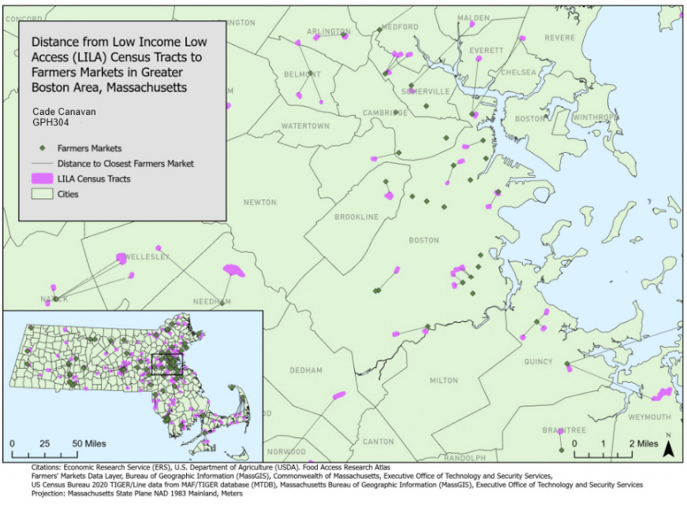
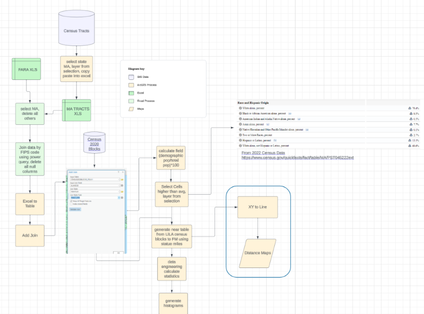

# Cade Canavan — GIS Portfolio

**B.S. Geography, Concentration in Sustainability | GIS Certificate**

Salem State University · May 2025 · GPA: 3.7 · *Magna Cum Laude*

Geospatial analyst with hands-on experience in spatial data workflows, UAV-based remote sensing, and public-sector GIS. Comfortable across the full project lifecycle — from field data collection and processing to cartographic output and stakeholder delivery. Background spans urban tree inventory, community planning, and food systems analysis.

---

## Technical Skills

| Domain | Tools & Methods |
|---|---|
| **GIS Platforms** | ArcGIS Pro, ArcGIS Online, QGIS, ArcGIS StoryMaps |
| **Spatial Analysis** | Vector & raster analysis, spatial joins, geocoding, near analysis, XY to Line, coordinate reference systems, projection management |
| **Remote Sensing & UAV** | Multispectral imagery, orthomosaic generation, NDVI, canopy height modeling, image segmentation |
| **Data & Visualization** | Excel, Power Query, cartographic design, demographic data aggregation |
| **Data Sources** | U.S. Census / TIGER, USDA Food Access Research Atlas, MassGIS, primary field & UAV data collection, municipal datasets |

---

## Projects

### UAV & AI Tree Canopy Health Analysis — Greenlawn Cemetery

Designed and executed a UAV-based spatial analysis workflow to assess tree health across an urban cemetery. Collected high-resolution multispectral imagery and processed it into orthomosaics, then applied AI-assisted image segmentation to delineate individual tree canopies. Generated NDVI rasters and a canopy height model to produce per-tree vegetation health metrics, supporting urban tree inventory and long-term management planning.

**Tools:** ArcGIS Pro · UAV / Multispectral Imagery · AI Segmentation · NDVI · Canopy Height Modeling

---

### Community Preservation Act StoryMap — City of Salem

**Salem Department of Planning and Community Development**

Geolocated and mapped 100+ CPA-funded projects across Salem using ArcGIS Pro, then built a public-facing interactive StoryMap to improve community access to project information. Developed a comprehensive, queryable spatial dataset with thematic maps organized by project type. Delivered as part of a GIS internship with the City of Salem.

**Tools:** ArcGIS Pro · ArcGIS Online · ArcGIS StoryMaps · Excel

➡️ [View the StoryMap](https://storymaps.arcgis.com/stories/97e90b2559804cc8bdd1a731b5f95ab3)

---

### Food Access & Farmers Markets — Greater Boston

**Salem State University — GPH304**

Analyzed the spatial relationship between USDA-designated Low Income, Low Access (LILA) census tracts and farmers market locations across the Greater Boston region. Joined 2020 Census demographic data to census tract boundaries via FIPS codes using Power Query, calculated per-tract demographic percentages, and generated a near table to measure proximity from each LILA block to the nearest farmers market. Produced distance maps using XY to Line and visualized results through histograms and summary statistics.

**Tools:** ArcGIS Pro · Excel · Power Query · Census / TIGER Data · USDA Food Access Research Atlas

---

## Background

- **GIS Internship** — City of Salem, Department of Planning and Community Development
- **President** — Salem State Geographical Society
- Open to GIS technician, environmental planning, and public-sector spatial analysis roles
- Open to relocation

---

## Contact

&nbsp;

&nbsp;

